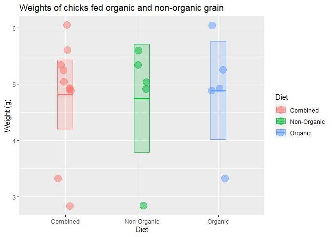

Lab 2 Assignment
================
Amara Miller
2021-01-21

## Instructions

Replace any triple underscores "\_\_\_" with the appropriate text.

Copy the appropriate code from your R script
[calculator.R](calculator.R) and paste it into the code chunks below.

## Code Practice

The final section of the Lab 2 instructions asks me to imagine I have
collected a sample of data which consisted of the following values:

    `6.05 4.89 3.32 4.93 5.25 5.04 4.91 2.84 5.60 5.34`

First, I combine the values into a vector using the `c()` function,
assign it to a variable named `x`, and print `x`

``` r
x <-  c(6.05, 4.89, 3.32, 4.93, 5.25, 5.04, 4.91, 2.84, 5.60, 5.34)
```

Here I calculate the sample size, mean, median, and standard deviation:

``` r
n <- length(x)
n
```

    ## [1] 10

``` r
mean(x)
```

    ## [1] 4.817

``` r
median(x)
```

    ## [1] 4.985

``` r
sd(x)
```

    ## [1] 0.9899725

The standard error of the mean can be calculated by dividing the
standard deviation by the square root of the sample size:

``` r
sem <- sd(x) / sqrt(n)
sem
```

    ## [1] 0.3130568

And finally, I can see the 95% confidence interval ranges from a minimum
of 4.203409 to a maximum of 5.430591

``` r
mean(x) + 1.96 * sem
```

    ## [1] 5.430591

``` r
mean(x) - 1.96 * sem
```

    ## [1] 4.203409

In this assignment I focused on using a single set of numbers, aka a
“vector”.

In the next lab we will begin using data frames, which are tables of
data consisting of multiple vectors.

As an example, imagine that the numbers above represent the weights of
chicks in an experiment. The first five numbers come from chicks that
were fed organic grain while the second were fed non-organic grain.

We could visualize the data as follows.

<!-- -->

## Session Info

Here is my session information:

``` r
sessioninfo::session_info()
```

    ## - Session info ---------------------------------------------------------------
    ##  setting  value                       
    ##  version  R version 4.0.3 (2020-10-10)
    ##  os       Windows 10 x64              
    ##  system   x86_64, mingw32             
    ##  ui       RTerm                       
    ##  language (EN)                        
    ##  collate  English_United States.1252  
    ##  ctype    English_United States.1252  
    ##  tz       America/Chicago             
    ##  date     2021-01-21                  
    ## 
    ## - Packages -------------------------------------------------------------------
    ##  package     * version date       lib source        
    ##  assertthat    0.2.1   2019-03-21 [1] CRAN (R 4.0.3)
    ##  backports     1.2.0   2020-11-02 [1] CRAN (R 4.0.3)
    ##  broom         0.7.3   2020-12-16 [1] CRAN (R 4.0.3)
    ##  cellranger    1.1.0   2016-07-27 [1] CRAN (R 4.0.3)
    ##  cli           2.2.0   2020-11-20 [1] CRAN (R 4.0.3)
    ##  colorspace    2.0-0   2020-11-11 [1] CRAN (R 4.0.3)
    ##  crayon        1.3.4   2017-09-16 [1] CRAN (R 4.0.3)
    ##  DBI           1.1.0   2019-12-15 [1] CRAN (R 4.0.3)
    ##  dbplyr        2.0.0   2020-11-03 [1] CRAN (R 4.0.3)
    ##  digest        0.6.27  2020-10-24 [1] CRAN (R 4.0.3)
    ##  dplyr       * 1.0.2   2020-08-18 [1] CRAN (R 4.0.3)
    ##  ellipsis      0.3.1   2020-05-15 [1] CRAN (R 4.0.3)
    ##  evaluate      0.14    2019-05-28 [1] CRAN (R 4.0.3)
    ##  fansi         0.4.1   2020-01-08 [1] CRAN (R 4.0.3)
    ##  farver        2.0.3   2020-01-16 [1] CRAN (R 4.0.3)
    ##  forcats     * 0.5.0   2020-03-01 [1] CRAN (R 4.0.3)
    ##  fs            1.5.0   2020-07-31 [1] CRAN (R 4.0.3)
    ##  generics      0.1.0   2020-10-31 [1] CRAN (R 4.0.3)
    ##  ggplot2     * 3.3.3   2020-12-30 [1] CRAN (R 4.0.3)
    ##  glue          1.4.2   2020-08-27 [1] CRAN (R 4.0.3)
    ##  gtable        0.3.0   2019-03-25 [1] CRAN (R 4.0.3)
    ##  haven         2.3.1   2020-06-01 [1] CRAN (R 4.0.3)
    ##  hms           1.0.0   2021-01-13 [1] CRAN (R 4.0.3)
    ##  htmltools     0.5.0   2020-06-16 [1] CRAN (R 4.0.3)
    ##  httr          1.4.2   2020-07-20 [1] CRAN (R 4.0.3)
    ##  jsonlite      1.7.2   2020-12-09 [1] CRAN (R 4.0.3)
    ##  knitr         1.30    2020-09-22 [1] CRAN (R 4.0.3)
    ##  labeling      0.4.2   2020-10-20 [1] CRAN (R 4.0.3)
    ##  lifecycle     0.2.0   2020-03-06 [1] CRAN (R 4.0.3)
    ##  lubridate     1.7.9.2 2020-11-13 [1] CRAN (R 4.0.3)
    ##  magrittr      2.0.1   2020-11-17 [1] CRAN (R 4.0.3)
    ##  modelr        0.1.8   2020-05-19 [1] CRAN (R 4.0.3)
    ##  munsell       0.5.0   2018-06-12 [1] CRAN (R 4.0.3)
    ##  pillar        1.4.7   2020-11-20 [1] CRAN (R 4.0.3)
    ##  pkgconfig     2.0.3   2019-09-22 [1] CRAN (R 4.0.3)
    ##  purrr       * 0.3.4   2020-04-17 [1] CRAN (R 4.0.3)
    ##  R6            2.5.0   2020-10-28 [1] CRAN (R 4.0.3)
    ##  Rcpp          1.0.5   2020-07-06 [1] CRAN (R 4.0.3)
    ##  readr       * 1.4.0   2020-10-05 [1] CRAN (R 4.0.3)
    ##  readxl        1.3.1   2019-03-13 [1] CRAN (R 4.0.3)
    ##  reprex        0.3.0   2019-05-16 [1] CRAN (R 4.0.3)
    ##  rlang         0.4.10  2020-12-30 [1] CRAN (R 4.0.3)
    ##  rmarkdown     2.6     2020-12-14 [1] CRAN (R 4.0.3)
    ##  rstudioapi    0.13    2020-11-12 [1] CRAN (R 4.0.3)
    ##  rvest         0.3.6   2020-07-25 [1] CRAN (R 4.0.3)
    ##  scales        1.1.1   2020-05-11 [1] CRAN (R 4.0.3)
    ##  sessioninfo   1.1.1   2018-11-05 [1] CRAN (R 4.0.3)
    ##  stringi       1.5.3   2020-09-09 [1] CRAN (R 4.0.3)
    ##  stringr     * 1.4.0   2019-02-10 [1] CRAN (R 4.0.3)
    ##  tibble      * 3.0.4   2020-10-12 [1] CRAN (R 4.0.3)
    ##  tidyr       * 1.1.2   2020-08-27 [1] CRAN (R 4.0.3)
    ##  tidyselect    1.1.0   2020-05-11 [1] CRAN (R 4.0.3)
    ##  tidyverse   * 1.3.0   2019-11-21 [1] CRAN (R 4.0.3)
    ##  vctrs         0.3.6   2020-12-17 [1] CRAN (R 4.0.3)
    ##  withr         2.3.0   2020-09-22 [1] CRAN (R 4.0.3)
    ##  xfun          0.20    2021-01-06 [1] CRAN (R 4.0.3)
    ##  xml2          1.3.2   2020-04-23 [1] CRAN (R 4.0.3)
    ##  yaml          2.2.1   2020-02-01 [1] CRAN (R 4.0.3)
    ## 
    ## [1] C:/Users/Amara/Documents/R/win-library/4.0
    ## [2] C:/Program Files/R/R-4.0.3/library
